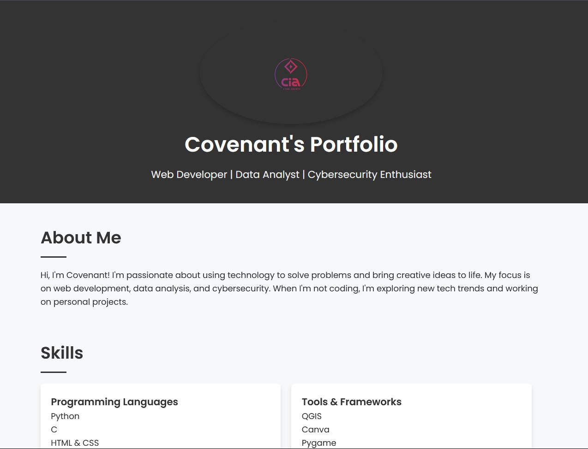

# Covenant's Portfolio 🌟

Welcome to my personal portfolio! Here, I showcase my skills and projects.

## Live Demo 🚀
[Visit Portfolio](https://cinioluwa.github.io/Portfolio)

## Features
- 🌙 Dark Mode Toggle
- 💻 Responsive Design
- 🎨 Smooth Animations

## Technologies Used
- HTML5
- CSS3
- JavaScript

## Screenshot 📸

## About Me ✨
I'm Covenant, a Web Developer, Data Analyst, and Cybersecurity Enthusiast. I build solutions that solve real-world problems.

## Featured Collaborations
I actively contribute to open-source and collaborative projects. Below are a few key projects where I played a significant role:

1. **[Dreamscapes Pygame Project](https://github.com/Femitun/pict-o-word)**
   - 🛠️ **Role**: Core Contributor  
   - 🎯 **Tech Stack**: Python, Pygame  
   - 🏆 **Highlight**: Developed core game mechanics and implemented interactive features for the Dreamscapes competition.  

Check out my contributions [here](https://github.com/Femitun/pict-o-word/commits?author=Cinioluwa).

## How to Contribute 🤝
Feel free to clone the repo, improve the code, or report bugs.

---
